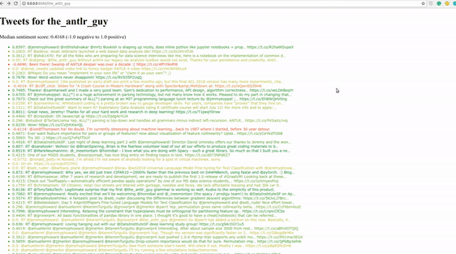

# Twitter sentiment analysis:smiley::blush::unamused::pensive::triumph:
## Overview  
The goal of this project is to learn how to pull twitter data, using the [tweepy](http://www.tweepy.org/) wrapper around the twitter API, and how to perform simple sentiment analysis using [the vaderSentiment](https://github.com/cjhutto/vaderSentiment) library. 

- get the followers of a specified user
`http://localhost/following/user_name`
- get a user's tweet list color-coded by sentiment, using a red to green gradient
`http://localhost/user_name`

## Demo
